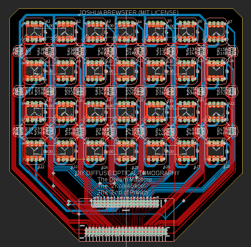

# DIY Diffuse Optical Tomography (DOT) PCB plans

This is unfinished (see unfinalized wiring in image). Too many projects Ahhhh!!

DIY DOT flexible sensor design based on [this 2007 Retinotopic mapping paper](https://www.pnas.org/content/104/29/12169) for a simple and modular 28 channel high-density optical tomography headset. 

This design uses 28 OPT101s and 24 pairs (48 total) 1206 sized generic LED pairs of whatever wavelength you want. The OPT101s can have the gain turned up by adding a cap and resistor between the right pins [see datasheet](https://www.ti.com/lit/ds/symlink/opt101.pdf?HQS=TI-null-null-alldatasheets-df-pf-SEP-wwe). You can get really cheap ones on Aliexpress that work consistently.

Use a site like PCBway for cheap flex PCBs. There is FR4 stiffener on both sides. This is meant to be hand-assembled, careful not to burn the pads or sensitive OPT101 pins (i.e. use low temperature solder for testing). Pop the OPT101s (notch facing left from the front) in through the back to make them flush with the stiffener and solder from back.  

### What you need to make it work:
* High channel-ct ADC, 24 bits recommended. See the [FreeEEG32](https://github.com/neuroidss/FreeEEG32-beta) for my board of choice.
* 48 GPIO or some kind of relay to drive the LEDs which need to be flashed independently. Can be done by stringing multiple cheap boards together via RX/TX pins (will publish examples eventually). 
* We recommend narrow-coned LEDs to minimize scalp interference for short separation channels.
* [Use 1068nm IR LEDs for best penetration.](https://www.spiedigitallibrary.org/journals/journal-of-biomedical-optics/volume-25/issue-09/097003/Diffuse-correlation-spectroscopy-measurements-of-blood-flow-using-1064nm-light/10.1117/1.JBO.25.9.097003.full?fbclid=IwAR02-l_q-xCykuuqUjc_RWJfQE7ESOEIRK0G9mqZSWaGiFhfwu1QNV42vjQ&SSO=1) The other LED can be red, green, or another IR wavelength (e.g. 850nm).

I'll update this soonish with finished plans and images of it assembled hooked up.

MIT License: Do whatever you want with it, I'm gonna do what I want with it too. And cite this repo if you make it useful!
