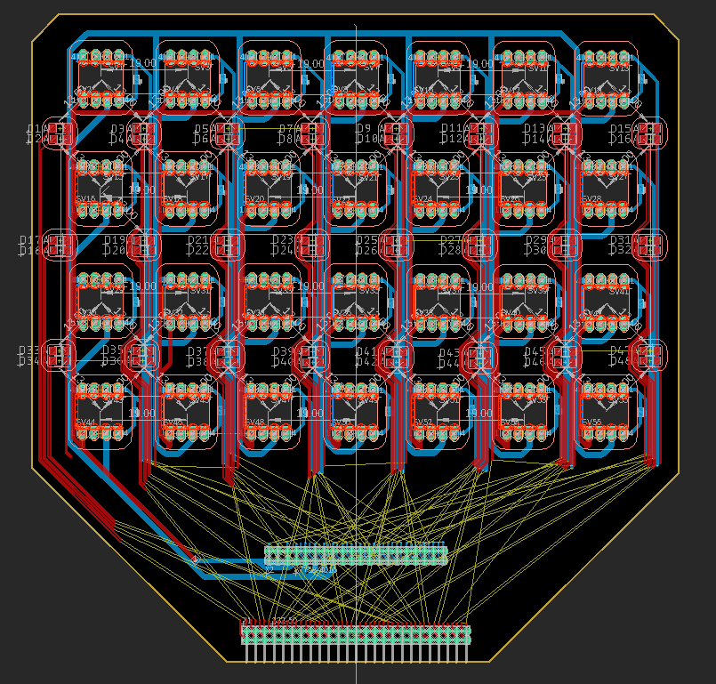

# DIY Diffuse Optical Tomography (DOT) PCB plans

This is unfinished (see unfinalized wiring in image). 

DIY DOT flexible sensor design based on [this 2007 Retinotopic mapping paper](https://www.pnas.org/content/104/29/12169) for a simple 28 channel high-density tomography headset. 

This design uses 28 OPT101s and 24 pairs (48 total) 1206 sized generic LED pairs of whatever wavelength you want. The OPT101s can have the gain turned up by adding a cap and resistor between the right pins [see datasheet](https://www.ti.com/lit/ds/symlink/opt101.pdf?HQS=TI-null-null-alldatasheets-df-pf-SEP-wwe). You can get really cheap ones on Aliexpress that work consistently.

What you need to make it work:
* High channel-ct ADC, 24 bits recommended See the [FreeEEG32](https://github.com/neuroidss/FreeEEG32-beta) for my board of choice.
* 48 GPIO or some kind of relay to drive the LEDs which need to be flashed independently.
* We recommend narrow-coned LEDs to minimize scalp interference.
* [Use 1068nm IR LEDs for best penetration.](https://www.spiedigitallibrary.org/journals/journal-of-biomedical-optics/volume-25/issue-09/097003/Diffuse-correlation-spectroscopy-measurements-of-blood-flow-using-1064nm-light/10.1117/1.JBO.25.9.097003.full?fbclid=IwAR02-l_q-xCykuuqUjc_RWJfQE7ESOEIRK0G9mqZSWaGiFhfwu1QNV42vjQ&SSO=1) The other LED can be red, green, or another IR wavelength (e.g. 850nm).

I'll update this with finished plans and images of it assembled hooked up.

MIT License: Do whatever you want with it, but I'm gonna do what I want with it too. And this repo if you use it!
