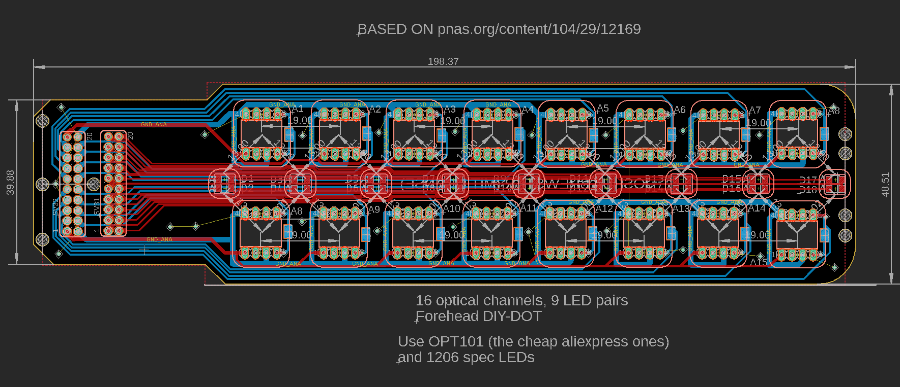

# DIY Diffuse Optical Tomography (DOT) PCB plans

Testing low cost 28 sensor DOT. This repo will be getting updated as I get results and some working code to share. I will share how to drive the LEDs and how I get simultaneous sensor output as I get things demonstrable.

DIY DOT flexible sensor design based on [this 2007 Retinotopic mapping paper](https://www.pnas.org/content/104/29/12169) for a simple and modular 28 channel high-density optical tomography headset. The question I want to answer: can I get [deep image reconstruction](https://journals.plos.org/ploscompbiol/article?id=10.1371/journal.pcbi.1006633)?

This design uses 28 OPT101s and 24 pairs (48 total) 1206 sized generic LED pairs of whatever wavelength you want. The OPT101s can have the gain turned up by adding a cap and resistor between the right pins [see datasheet](https://www.ti.com/lit/ds/symlink/opt101.pdf?HQS=TI-null-null-alldatasheets-df-pf-SEP-wwe). You can get really cheap ones on Aliexpress that work consistently.

Use a site like PCBway for cheap flex PCBs. There is FR4 stiffener on both sides. This is meant to be hand-assembled, careful not to burn the pads or sensitive OPT101 pins (i.e. use low temperature solder for testing). Pop the OPT101s (notch facing left from the front) in through the back to make them flush with the stiffener and solder from back.  

# 16 channel (forehead-friendly)

New (cheapo version):

New (includes transimpedance amps):

Old:

# LED Driver example w/ TLC5955DCA

# WIP Software for capture and simulation:

3D simulation with BabylonJS:
- https://github.com/joshbrew/DIY_DOT/tree/main/js/bananas
Recording test for our nRF5x boards (WIP connector/carrier board incoming after we test it):
- https://github.com/joshbrew/DIY_DOT/tree/main/js/record_nirs

The simulation math needs help but we'll figure it out eventually.

### What you need to make it work:
* We are working on boards here with LED compatibility, need to add support for the TLC5955DCA. See [nRF5x Biosensing Boards](https://github.com/brainsatplay/nrf5x-biosensing-boards) Includes 16 channel support, you can add more which we'll try eventually.
* 48 GPIO or some kind of relay to drive the LEDs which need to be flashed independently. Can be done by stringing multiple cheap boards together via RX/TX pins (will publish examples eventually). 
* We recommend narrow-coned LEDs to minimize scalp interference for short separation channels.
* Add light pipes over PD and LED areas to get better contact.
* [Use >1000nm IR LEDs for best penetration. (no idea if they exist at this size)](https://www.spiedigitallibrary.org/journals/journal-of-biomedical-optics/volume-25/issue-09/097003/Diffuse-correlation-spectroscopy-measurements-of-blood-flow-using-1064nm-light/10.1117/1.JBO.25.9.097003.full?fbclid=IwAR02-l_q-xCykuuqUjc_RWJfQE7ESOEIRK0G9mqZSWaGiFhfwu1QNV42vjQ&SSO=1) The other LED can be red, green, or another IR wavelength (e.g. 850nm).

## What can I do with this?

Read about fMRI, then assume this is an fMRI but it's dirt cheap in comparison. However, it only gets you the few outer centimeters of depth resolution, which can be enhanced with higher power lighting, guassian windows, interferometry (the most interesting next logical step for this ala OCT), and some other classic filtering tricks from RF and astronomy. So we can do legit mind reading, source localization for EEG, brain topology studies, and potentially real time monitoring of problems like subdural hematoma or possible metabolic issues in the high energy-demanding neocortex. Multimodal imaging promises to solve a lot of modeling problems with this technology, and there's probably a lot more to learn just in terms of how different physiology contains relevant computational information and what the interplay is. That's my very unqualified 2 cents :P

## License 
MIT License: Do whatever you want with it, I'm gonna do what I want with it too. And cite this repo if you make it useful! 
Get in touch @ brewster.joshua1@gmail.com, I'm working on a scalable version of this stuff but it just takes forever between factory times and me not knowing what the hell I'm doing. 
